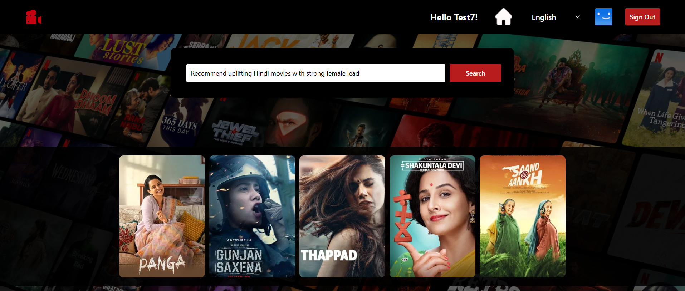
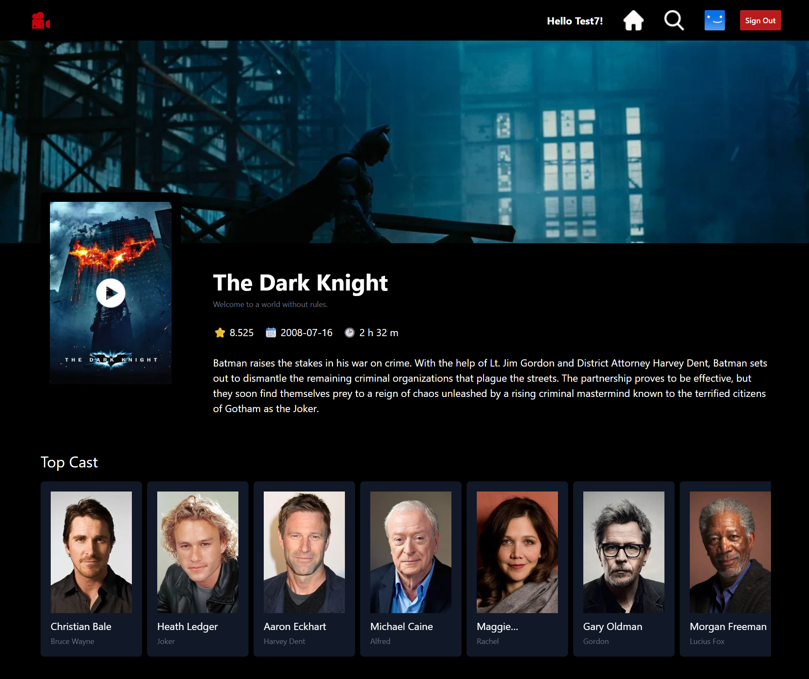

# 🎬 Film Finder – AI-Powered Movie Discovery Platform

Film Finder is a responsive movie discovery web application that helps users explore trending movies, trailers, cast information, and personalized recommendations using AI-powered search. Instead of relying only on keyword searches, users can discover movies based on mood and preferences.

---

## 🔗 Live Demo

https://filmfinder-gpt.vercel.app

---

## ✨ Features

- Browse trending movies, trailers, cast, and detailed metadata using TMDB APIs
- AI-powered movie recommendations using OpenAI API with mood-based and preference-driven queries
- Reusable Netflix-inspired horizontal carousel components for smooth content browsing
- Robust async UX patterns including loading skeletons, error states, offline detection, and automatic refetch on network reconnection
- Firebase authentication with persistent session handling
- Fully responsive UI built with Tailwind CSS

---

## 🛠️ Tech Stack

- React
- Redux Toolkit
- React Router
- Tailwind CSS
- Firebase Authentication
- TMDB API
- OpenAI API

---

## 📸 Screenshots

### Home Page

### AI-Powered Search

### Movie Details & Trailer

---

## 🔮 Future Improvements

- Add user watchlists and favorites
- Improve AI recommendation accuracy with user history
- Add infinite scrolling and advanced filtering

---

## 👤 Author

Anusree S Jith  
Frontend Engineer  
LinkedIn: https://www.linkedin.com/in/anusreesjith
